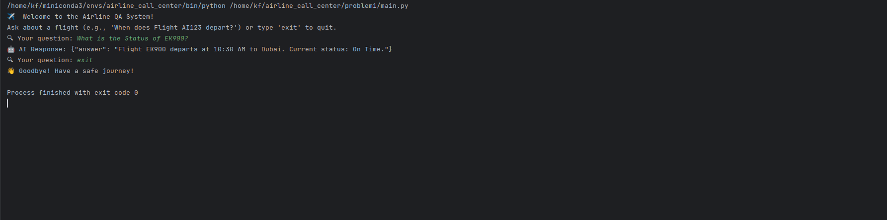

# Problem 1: Airline Call Center - Two-Agent System with Function Calling & Structured Output

## Overview
This project implements a collaborative AI system for airline flight information using two specialized agents:
- **Info Agent**: Retrieves structured flight data from MongoDB
- **QA Agent**: Processes natural language queries and returns user-friendly responses

The system simulates an airline call center where customers can inquire about flight details through natural language queries.

## System Architecture
The system demonstrates:
- **Multi-Agent Coordination**: Two AI agents working together seamlessly
- **Function Calling**: QA Agent invoking Info Agent's functions
- **Structured JSON Output**: All responses follow a defined schema
- **Prompt Engineering**: Effective AI guidance for flight number extraction
- **MongoDB Integration**: Flight data stored and retrieved from MongoDB Atlas

## Screenshot



## Setup Requirements
1. Python 3.8+
2. Together AI API key
3. MongoDB Atlas account and connection string

## Installation
1. Clone the repository:
```bash
git clone <repository-url>
```
```bash
cd problem1
```

2. Create and activate a virtual environment:
```bash
python3 -m venv venv
```
```bash
source venv/bin/activate
```

3. Install dependencies:
```bash
pip install -r requirements.txt
```

4. Configure your API keys:
```bash
echo "TOGETHER_API_KEY=your_key_here" > .env
echo "MONGO_PASSWORD=your_mongodb_password" >> .env
```

## Database Setup
The system uses MongoDB Atlas to store flight information. To populate the database with sample flight data:

```bash
python insert_db.py
```

This will insert sample flight records including AI123, EK500, LH789, and EK900 into the MongoDB collection.

## Usage
Run the interactive airline call center system:
```bash
python main.py
```

## Key Components

### 1. Database Connection (db.py)
- Establishes connection to MongoDB Atlas
- Provides access to the flights collection

### 2. Database Population (insert_db.py)
- Populates the MongoDB database with sample flight data
- Creates flight records with flight number, departure time, destination, and status

### 3. Info Agent (main.py)
- **Function**: `get_flight_info(flight_number: str) -> dict`
- **Purpose**: Retrieves structured flight data from MongoDB
- **Output**: Python dictionary with flight information
- **JSON Interface**: `info_agent_request(flight_number: str) -> str`

### 4. QA Agent (main.py)
- **Function**: `qa_agent_respond(user_query: str) -> str`
- **Purpose**: Processes natural language queries about flights
- **Process**:
   1. Extracts flight number from query using LLaMA 3.3 70B model
   2. Calls Info Agent to fetch flight data from MongoDB
   3. Returns structured JSON response

## Example Interactions

| User Query | Response |
|------------|----------|
| "When does Flight AI123 depart?" | `{"answer": "Flight AI123 departs at 08:00 AM to Delhi. Current status: Delayed."}` |
| "What is the status of Flight EK500?" | `{"answer": "Flight EK500 departs at 10:30 AM to Dubai. Current status: On Time."}` |
| "What is the status of Flight AI999?" | `{"answer": "Flight AI999 not found in database."}` |

## Advanced Features
- AI-powered flight number extraction using LLaMA 3.3 70B model
- Regex-based fallback extraction for reliable flight number detection
- MongoDB Atlas integration for flight data storage
- Comprehensive error handling for database connections
- Interactive command-line interface
- Simulated airline call center experience

## Evaluation Criteria
This system demonstrates:
- ✅ Multi-Agent Coordination
- ✅ Function Calling
- ✅ Structured JSON Output
- ✅ Effective Prompt Engineering
- ✅ Database Integration
